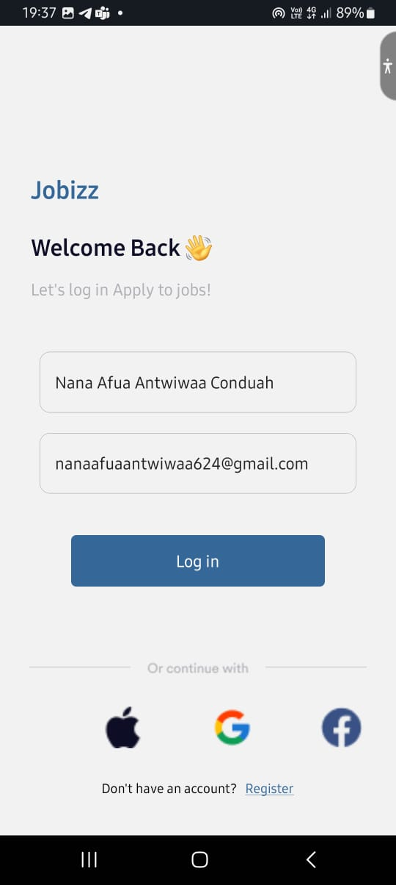
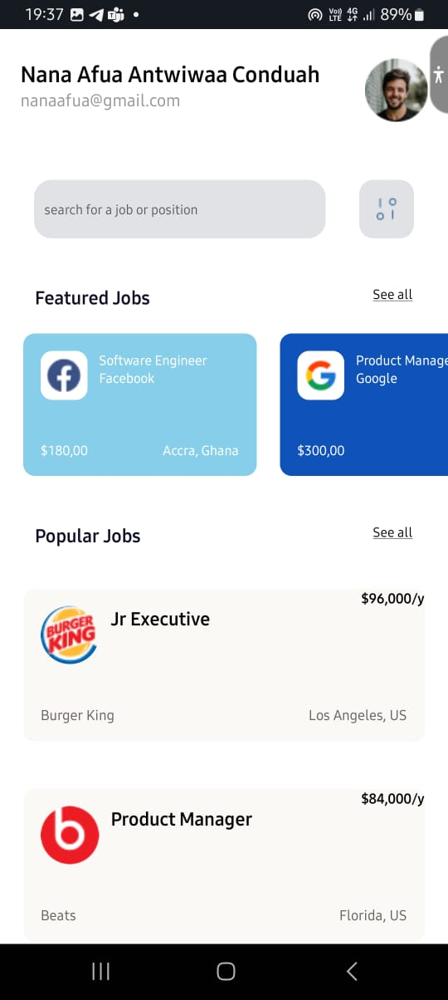
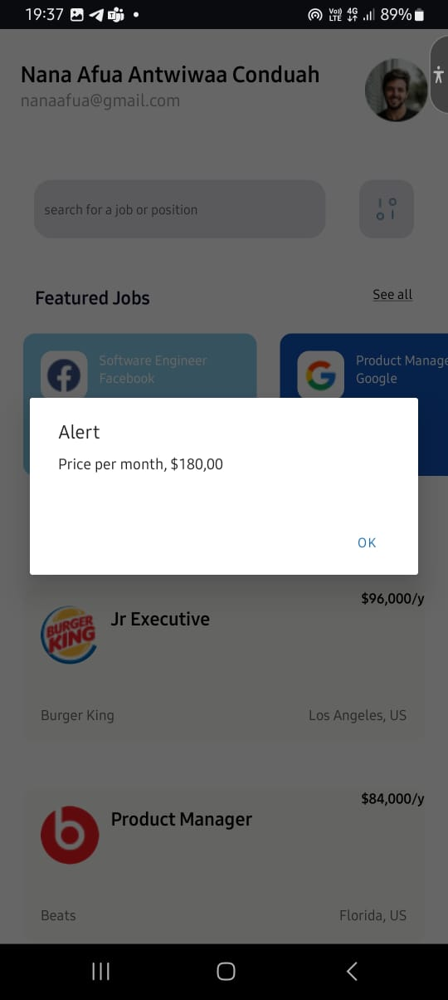
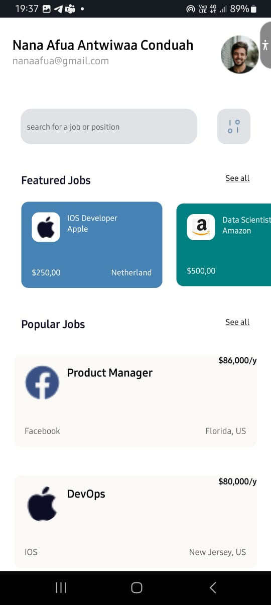
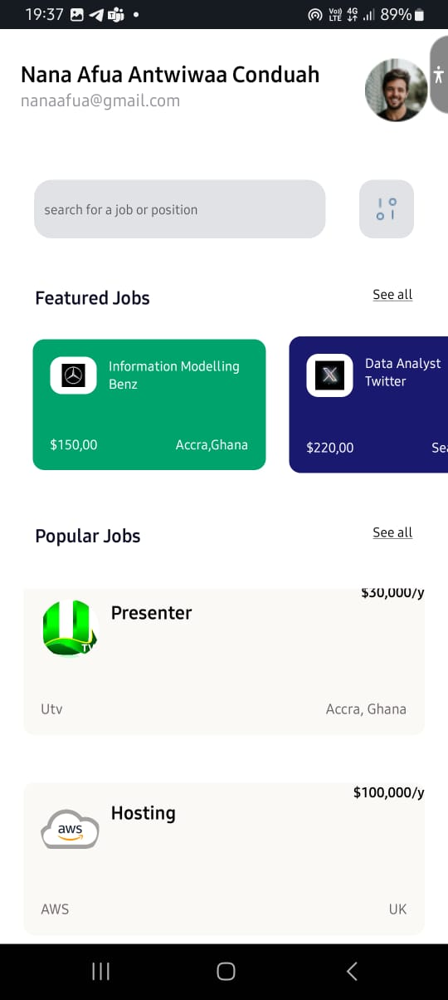
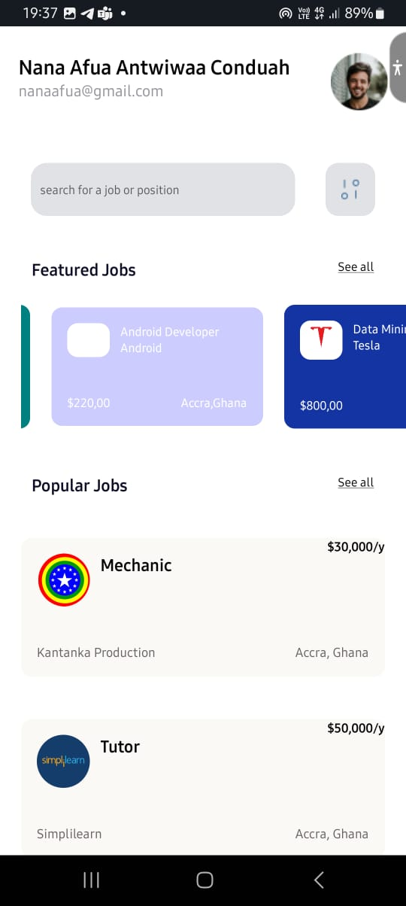

# rn-assignment4-11179865

Componets Folder includes;

1. Jobcard
2. Personpage
3. Popularjob

Jocard

This contains the accepts props like jobtitle,company,location,salary,image,styles and these are different on each card as seen in the screenshot.This component is part of the home page that displays the featured jobs.This components allows the user to scroll horizontally and also read an alert from each card when tapped.There is the use of touchableOpacity too.

Personpage

This contains the display of the name,email,picture ,search input and the menu icon beside it.The search input allows one to input to search for job and ther is the use of touchableopacity there too.There are 8 components

Popularjobs

This coontains the popular jobs displayed on the UI like the king burger,beats and added cards by me such as kantanka,utv,simplelearn ,hosting and other three.

Home
This contains the all the file in the components folder

Login
This contains the login page

     
